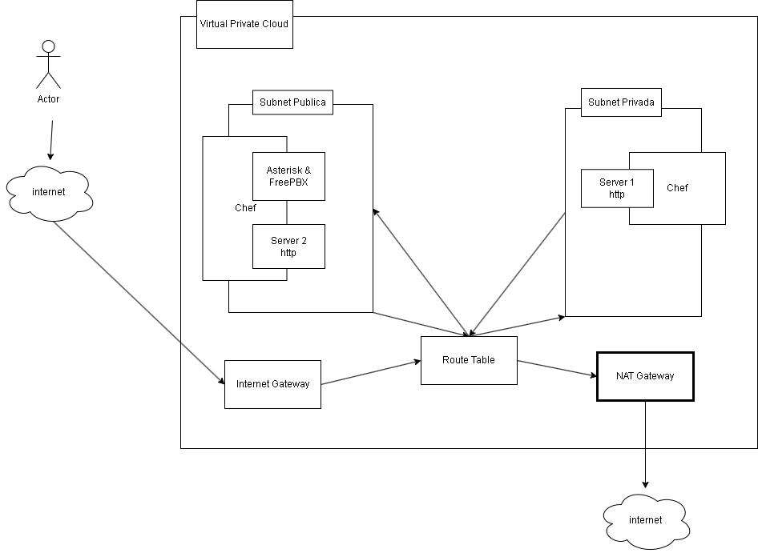
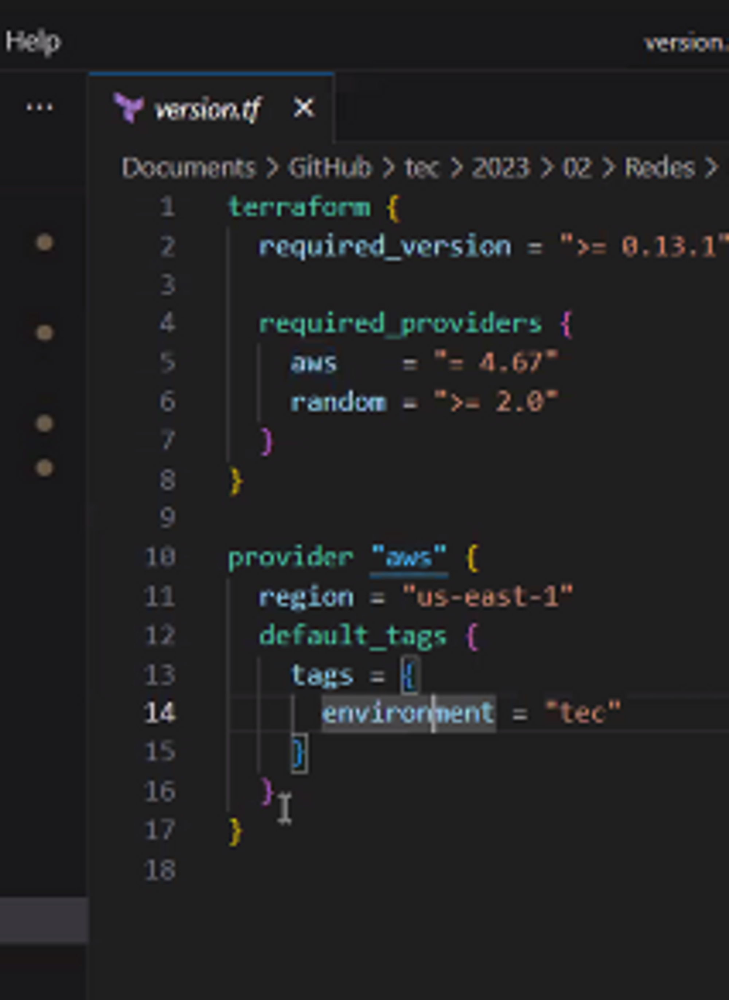
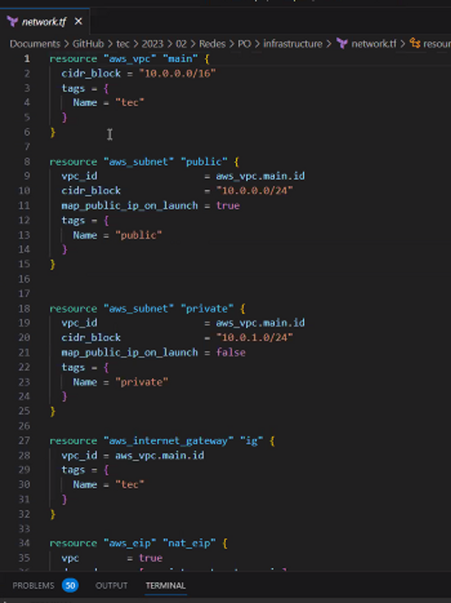
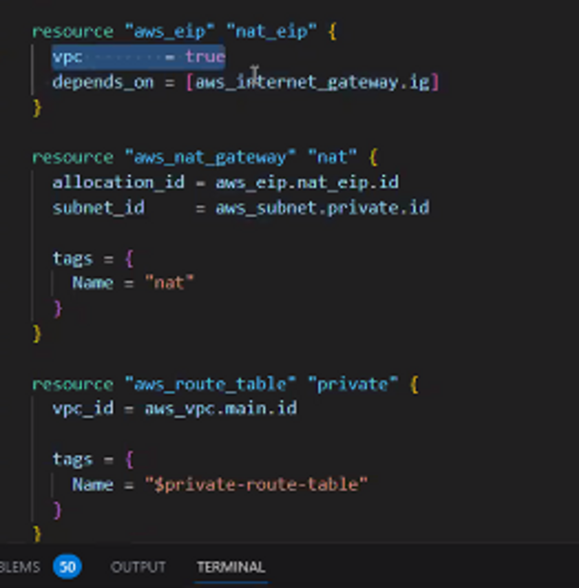
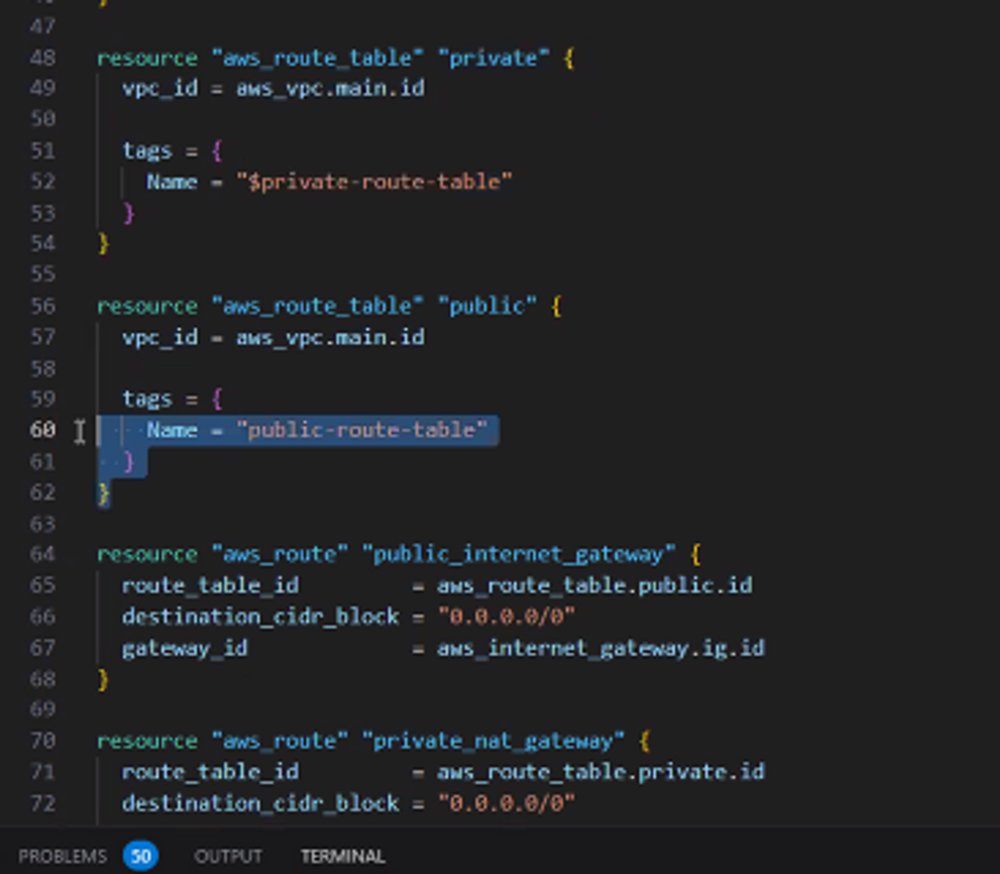
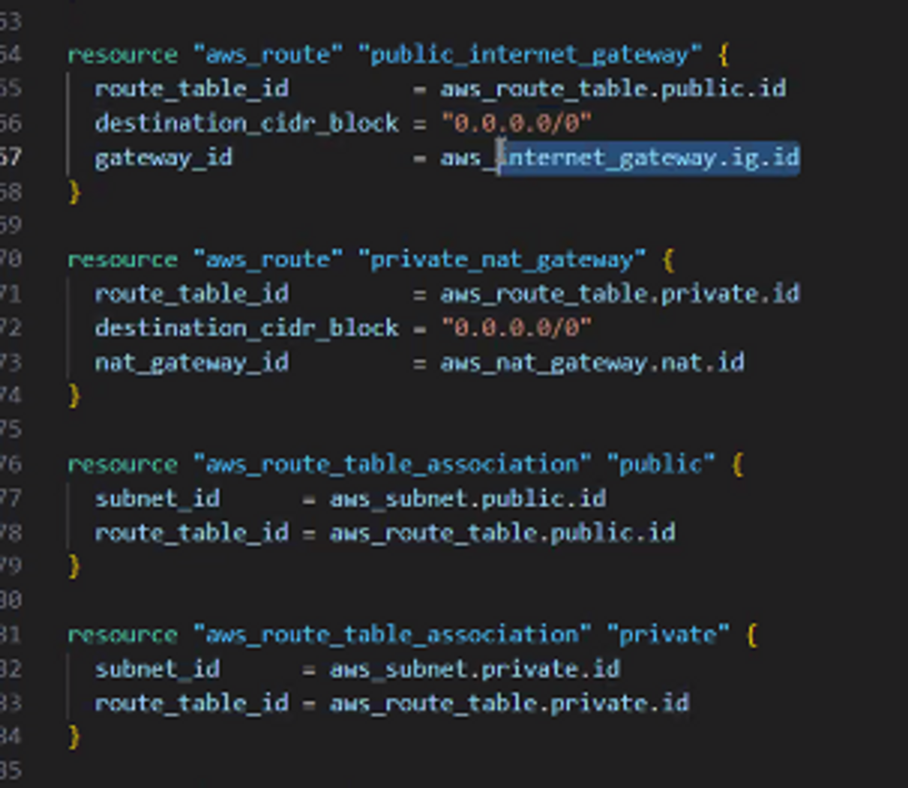

# Resumen de la Clase 28/07/2023

Palabras clave: _FreePBX, Asterisk, Terraform, Oracle Academy, GCD, AWS, Chef, Puppet, Ansible, Virtual Box, Subred, Server, Responsability Matrix AWS, Hypervisor, PAAS, CIDR, VPC, Availability Zones, Route Table, Peering, Internet Gateway, NAT Gateway, Security Gruop, Firewall, TCP, UDP, NACL, IaC, Cloud Provider_

## Introducción

La clase fue básicamente un demo de una manera de realizar el proyecto, el profesor explicó detalladamente los conceptos básicos que debemos manejar, y las herramientas que debemos utilizar. Este resumen primero explicará en que consiste el proyecto, luego habrá una sección donde profundizaremos en los conceptos generales y por último en la sección de herramientas se expondrán algunas de las características de cada herramienta.

## Resumen General del Proyecto

Este proyecto es una introducción al uso de los “cloud providers” e implementar funcionalidades características de las redes, como lo es el intercambio de información y su transporte. También se utilizarán herramientas de automatización de la infraestructura y administración de la configuración para introducirnos en el concepto de la reproductibilidad.

Lo primero es crear una “virtual private cloud”, en la clase fue con servicios Amazon pero existen otras herramientas como “Oracle Academy”, se elige el lugar donde estará el servidor, en síntesis se escoge una red de disponibilidad. Amazon es global y tiene regiones. Dentro de las regiones tiene “Availability Zones”, de 3 a 9 por región.

Luego se deben crear dos subredes, una pública y otra privada, comunicarlas con los demás componentes a través de un “route table”; así se podrá establecer una comunicación con la internet a través de un “nternet gateway” y conectar su salida con un “NAT Gateway”.

Dentro de la subred pública debemos instalar Asterisk y FreePBX, la instalación debe ser automatizada por lo que se debe usar alguna herramienta como Chef, Puppet o Ansible. Se crea una extensión SIP y hacemos llamadas mediante un cliente SIP, en IPhone o Android.

Siguiendo en la subred pública debemos instalar un servidor Apache, igualmente con una herramienta de automatización, debe contener una simple página HTML que diga “Server 1”.

En la subred privada también debemos instalar un servidor Apache, de la misma forma que en el público, con una página HTML que diga “Server 2”.

## Conceptos Importantes

Cloud Provider: Un proveedor de servicios en la nube es una empresa o entidad que ofrece una variedad de servicios y recursos informáticos a través de internet. Estos servicios suelen incluir almacenamiento de datos, capacidad de procesamiento, bases de datos, aplicaciones y más. Operan y mantienen una infraestructura de servidores y centros de datos a gran escala, lo que permite a los usuarios acceder y utilizar estos recursos bajo demanda y pagando únicamente por el uso que hacen de ellos. (Amazon Web Services (AWS), Microsoft Azure, Google Cloud Platform (GCP),IBM Cloud, …)

Redes: Una red se refiere al conjunto de dispositivos (como computadoras, servidores, dispositivos móviles, impresoras, etc.) interconectados entre sí para compartir recursos y comunicarse. Las redes permiten la transferencia de datos y la comunicación entre los dispositivos conectados, lo que facilita el intercambio de información y el acceso a recursos compartidos, como archivos, impresoras, servicios y conexiones a internet.

Reproductibilidad: Es la capacidad de reproducir una configuración las veces necesarias en cualquier entorno solicitado. Siendo un poco más técnico, sería la capacidad de replicar y mantener una configuración de red específica en diferentes momentos y/o ubicaciones con resultados consistentes y predecibles. Se utiliza porque reduce la cantidad de errores, aumenta la eficiencia, aumenta la estabilidad, y facilita el cumplimiento de políticas y estándares.

GDC: Grand Central Dispatch es una tecnología desarrollada por Apple para la administración y programación concurrente en sistemas operativos como macOS e iOS. GCD proporciona una forma eficiente y sencilla de realizar tareas en paralelo y administrar la concurrencia en aplicaciones.

AWS: “Amazon Web Services" se trata de una plataforma de servicios en la nube ofrecida por Amazon, que proporciona una amplia gama de servicios de cómputo y permite a individuos, empresas y organizaciones acceder a recursos informáticos de alta calidad sin tener que invertir en infraestructura física propia.

Subred: Una subred (o subnet en inglés, abreviatura de "subnetwork") es una subdivisión de una red de computadoras más grande en partes más pequeñas y manejables. Las subredes se utilizan para organizar y administrar de manera más eficiente las direcciones IP y los dispositivos en una red.

Cada subred tiene su propia gama de direcciones IP que pertenecen a una red más grande. Esto permite una mejor administración de las direcciones IP y facilita la segmentación de la red en grupos lógicos de dispositivos con características y funciones similares. Las subredes también pueden estar separadas por routers, lo que permite el enrutamiento de tráfico entre ellas.

Server: Es una computadora o sistema que proporciona servicios, recursos o datos a otros dispositivos o usuarios en una red. Los servidores están diseñados para ejecutar aplicaciones, gestionar recursos y responder a solicitudes de otros dispositivos, conocidos como "clientes".
Responsability Matrix AWS: Establece de que es responsable el usuario y de que se encarga los servicios de Amazon, su objetivo es definir y comunicar claramente las responsabilidades entre diferentes partes (proveedor y cliente) en la gestión, operación y seguridad de los recursos y servicios en la nube.

Hypervisor: Permite crear y administrar múltiples máquinas virtuales (VM) en un solo servidor físico. Así que básicamente maneja la creación de redes y la administración de varios servicios.

PAAS: Plataforma como Servicio (PaaS: Platform as a Service) es un modelo de computación en la nube que proporciona un entorno de desarrollo y despliegue completo para aplicaciones. En lugar de preocuparse por la infraestructura subyacente y la administración de servidores, los desarrolladores pueden centrarse en la creación y el despliegue de sus aplicaciones.

CIDR: Clasificación Inter-Dominio sin Clases, por sus siglas en inglés: Classless Inter-Domain Routing es un sistema de notación utilizado para describir bloques de direcciones IP y subredes en redes IP.

Virtual Network: Un "virtual network" se refiere a una red lógica que se crea dentro de un entorno de virtualización, como la nube o la virtualización en servidores.

VPC: Una “Virtual Private Cloud” es un servicio proporcionado por Amazon Web Services (AWS) que permite a los usuarios crear su propia red virtualizada en la nube. Es un entorno de red aislado y configurable en el cual los usuarios pueden lanzar recursos de AWS.

Global: En AWS, "global" se refiere a los servicios y componentes que están disponibles en múltiples regiones geográficas. Una "región" en AWS es una ubicación geográfica física que contiene una o más "Availability Zones" (Zonas de Disponibilidad), que son centros de datos independientes y separados físicamente dentro de la misma región. 

Availability Zones: Cada región de AWS se compone de varias Availability Zones. Una Availability Zone es un centro de datos aislado y físicamente separado dentro de una región. Cada Availability Zone tiene su propia infraestructura, energía, refrigeración y conectividad de red. El diseño de Availability Zones permite que las aplicaciones y los recursos se desplieguen en múltiples zonas para lograr alta disponibilidad y tolerancia a fallos. Si un Availability Zone falla debido a una interrupción, los recursos pueden redirigirse automáticamente a otras Availability Zones en la misma región sin afectar la disponibilidad.

Route Table: Una Tabla de enrutamiento en Amazon Web Services (AWS) define cómo se debe dirigir el tráfico entre diferentes subredes o destinos en una red.

Peering: Es una conexión directa entre dos redes independientes para permitir que el tráfico fluya entre ellas sin pasar por redes de terceros.
	
IPSec Tunnels: Un túnel IPSec (IP Security) es una tecnología de redes que se utiliza para crear una conexión segura y encriptada entre dos redes o dispositivos a través de una red pública.

Internet Gateway: Una Puerta de Enlace a Internet permite la comunicación bidireccional entre instancias en una VPC y la Internet pública. Cada máquina virtual en la red tiene asignada un ip público.

 NAT Gateway: Una Puerta de enlace NAT es un servicio de AWS que permite que las instancias en una VPC accedan a Internet o a otros servicios fuera de la VPC, sin que las instancias en Internet puedan iniciar conexiones directas hacia las instancias en la VPC.

Security Group: Un Grupo de Seguridad es un componente de AWS que controla el tráfico de red hacia y desde instancias y recursos dentro de una VPC. Un Security Group actúa como un cortafuegos virtual que regula las comunicaciones de red y permite especificar qué tipos de tráfico están permitidos y desde dónde. Es parecida a un Firewall.

Firewall: Es un componente de seguridad utilizado para controlar y gestionar el tráfico de red entrante y saliente en una red o sistema informático. El objetivo principal de un firewall es proteger la red y los dispositivos contra amenazas y accesos no autorizados, permitiendo solo el tráfico que cumple con las políticas de seguridad establecidas.

TCP: Transmission Control Protocol es un protocolo de capa de transporte que proporciona una comunicación confiable y orientada a la conexión entre dispositivos en una red. TCP se utiliza para establecer y gestionar la comunicación entre aplicaciones que se ejecutan en diferentes sistemas, garantizando que los datos se entreguen correctamente y en orden.

UDP: User Datagram Protocol es un protocolo de la capa de transporte en la suite de protocolos de Internet (TCP/IP). A diferencia de TCP, el UDP es un protocolo más simple y rápido que se utiliza para la transmisión de datos en redes donde la velocidad y la eficiencia son más prioritarias que la garantía de entrega y el ordenamiento de los datos.

NACL: Network Access Control List es un servicio de seguridad proporcionado por AWS que se utiliza para controlar el tráfico de red entrante y saliente a nivel de subnet en una VPC. Aunque NACL y Security Groups comparten la función de controlar el acceso a recursos de red, existen diferencias clave en cómo funcionan y en qué nivel operan. Pero al final las NACLs y los Security Groups son herramientas complementarias en la estrategia de seguridad.

IaC: Infrastructure as Code es una metodología en la que la infraestructura de una aplicación o sistema se define, administra y provisiona mediante código en lugar de configuraciones manuales tradicionales. IaC trata la infraestructura como si fuera un conjunto de código, permitiendo la automatización, la repetibilidad y la consistencia en el despliegue y la gestión de la infraestructura.

## Herramientas Útiles

FreePBX: es una plataforma de administración de PBX (Private Branch Exchange) de código abierto que permite a las organizaciones configurar, administrar y mantener sistemas de telefonía basados en IP (VoIP) de manera eficiente. Un PBX es un sistema telefónico que facilita las comunicaciones internas y externas en una organización al enrutamiento de llamadas y la gestión de funciones telefónicas.

Asterisk: Asterisk es una plataforma de comunicaciones de código abierto que permite crear sistemas de telefonía, comunicaciones unificadas y aplicaciones de voz sobre IP (VoIP).

Terraform: Terraform es una herramienta de infraestructura como código (IaC) de código abierto desarrollada por HashiCorp. Se utiliza para crear, configurar y administrar infraestructuras en la nube y recursos de manera automatizada y declarativa. Terraform permite definir la infraestructura deseada en un archivo de configuración, luego despliega y administra esos recursos en proveedores de nube como Amazon Web Services (AWS), Microsoft Azure, Google Cloud Platform (GCP) y otros.

Ejemplo de uso vistos en clase:

Especificar el provider, en version.tf

Definición de la red 

Se crea el nat gateway y se le asigna el ip público

Se crea una tabla de ruteo privado y una de ruteo publico

Se definen rutas muy simples

Notas: “siempre que ustedes ejecutan terraform hacen un git status o un gitignore pra no tener que hacerlo y borrar la carpeta que se llama .terraform y .terraform.lock se ignora. Y se hace un push del state y el state backup”

Oracle Academy: Oracle Academy es un programa educativo de Oracle Corporation que brinda recursos y materiales para enseñar tecnología y habilidades relacionadas con la informática y la tecnología de la información en instituciones académicas de todo el mundo. El programa se enfoca en brindar a estudiantes y educadores acceso a herramientas y recursos que les ayuden a aprender sobre bases de datos, programación, desarrollo de aplicaciones y más, utilizando tecnologías de Oracle.

Chef: Es una plataforma de automatización de TI de código abierto que permite a los equipos de operaciones y desarrollo automatizar la configuración, la implementación y la gestión de infraestructuras y aplicaciones. Con Chef, se pueden definir y codificar la configuración de tus sistemas y luego automatizar su implementación y mantenimiento. Chef forma parte de la categoría de herramientas de Infraestructura como Código (IaC) y es utilizado en DevOps para agilizar y estandarizar el proceso de administración de sistemas y aplicaciones.

	

